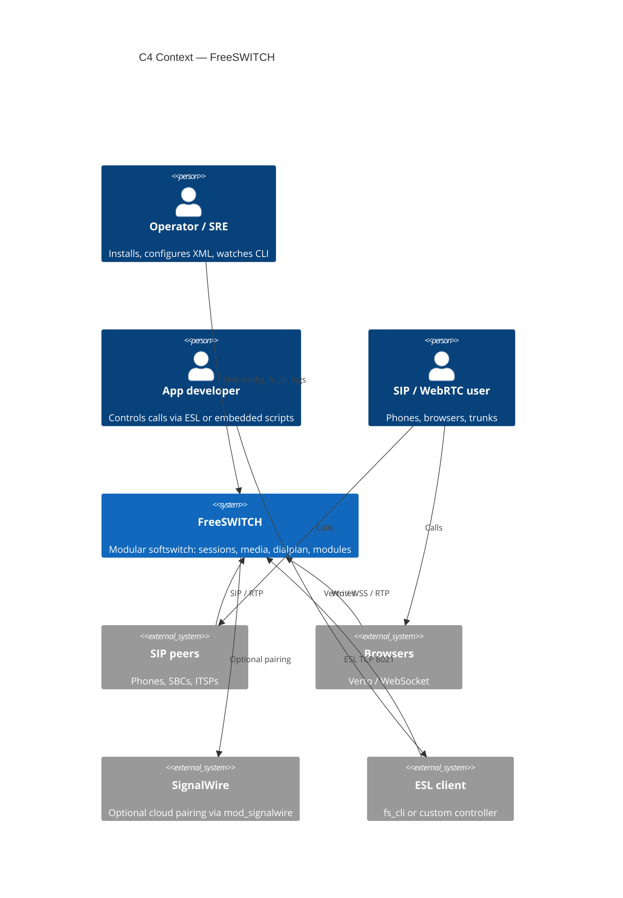

# 00. Project Overview

<!-- maintained-by: human+ai -->

FreeSWITCH is a modular softswitch: a software-defined telecom stack that replaces proprietary PBX and class-5 switching hardware with a process that runs on commodity servers, from a Raspberry Pi to a multi-core host. This repository is the C core, loadable modules, XML configuration profiles, packaging, and Event Socket tooling for that stack. Version in this tree is **1.11.3-dev** (`configure.ac`). License is **MPL 1.1**. SignalWire is the primary sponsor; `mod_signalwire` in this tree pairs a local switch with SignalWire cloud services.

## Purpose

- Switch, bridge, and transcode real-time voice, video, and messaging sessions.
- Expose a loadable-module API so SIP, WebRTC, codecs, dialplans, languages, and CDR backends can be added without forking the core.
- Provide a working default PBX configuration (`conf/vanilla`) so operators can start testing immediately.
- Offer an out-of-process control plane (Event Socket / ESL) so applications can originate, hang up, and subscribe to events without embedding in the media process.

This PKB documents **this source tree**. Operator configuration — XML, directory, SIP profiles, dialplan, codecs, applications, WebRTC, ESL — lives in the [FreeSWITCH Users Manual](https://developer.signalwire.com/freeswitch/). Every parameter table there is verified against FreeSWITCH source and the shipped vanilla config. Older wiki pages remain on [FreeSWITCH Explained](https://developer.signalwire.com/freeswitch/FreeSWITCH-Explained/) and [Confluence](https://freeswitch.org/confluence/).

The Users Manual applies to both **Open Source FreeSWITCH** (this tree and [release builds](https://files.freeswitch.org/releases/freeswitch/)) and **FreeSWITCH Enterprise** (commercially supported SignalWire builds). Hosted SignalWire cloud is still a separate product.

## Scope Boundaries

| In scope | Out of scope |
|----------|--------------|
| Core switch process (`src/switch.c`, `src/switch_core.c`) and session/media/event libraries | SignalWire hosted cloud, SMS, and serverless products (separate repos and services) |
| Loadable modules under `src/mod/` (endpoints, codecs, applications, event handlers, languages, XML interfaces) | Prompt/sound packages (`freeswitch-sounds-*` specs and the [sounds release repo](https://github.com/freeswitch/freeswitch-sounds)) |
| XML config profiles (`conf/vanilla`, `conf/sbc`, `conf/minimal`, …) and module autoload list (`build/modules.conf.in`) | Third-party Sofia-SIP / spandsp packaging sources that live outside this tree |
| ESL library and `fs_cli` (`libs/esl/`) | A hosted multi-tenant SaaS control plane |
| Autotools/Windows/Docker/Debian packaging in this repo | Duplicating Users Manual parameter tables — link out instead |

## Key Users and Use Cases

- **PBX / CCaaS operator**: run vanilla or a custom XML profile as an IP-PBX, conference, voicemail, or call-center node; register SIP phones; route DIDs.
- **SBC / interconnect engineer**: use the `conf/sbc` profile and Sofia SIP (`mod_sofia`) to border-control SIP trunks and media.
- **Application developer**: control calls from Lua/Python/JavaScript modules or from an external process over ESL (`mod_event_socket` on TCP 8021, `libs/esl/fs_cli.c`).
- **WebRTC / HTML5 developer**: terminate browser sessions through Verto (`mod_verto`, endpoint name `verto.rtc`).
- **Module developer**: implement `SWITCH_MODULE_LOAD_FUNCTION` against `src/include/switch.h` and drop a `.so` into the modules directory.
- **Packager / SRE**: build from source (`bootstrap.sh` + Autotools), Debian packages (`debian/`, `scripts/packaging`), Windows (`w32/`, `Freeswitch.2017.sln`), or Docker (`docker/`).

## Three Configuration Domains

The Users Manual ([Chapter 1](https://developer.signalwire.com/freeswitch/foundations/introduction)) splits operator config into three domains. This tree stores them under `conf/vanilla/` (installed as the configuration root that contains `freeswitch.xml`):

| Domain | Question it answers | Vanilla path | Hunt / load |
|--------|---------------------|--------------|-------------|
| Directory | Who may connect, and with what properties? | `conf/vanilla/directory/` | SIP digest, `user_context`, `user/` bridge lookup |
| Dialplan | When a call arrives, where does it go? | `conf/vanilla/dialplan/` | `mod_dialplan_xml` in `CS_ROUTING` |
| Configuration | How do the core and each module behave? | `conf/vanilla/autoload_configs/` | Module `.conf.xml` blocks; SIP profiles live beside this in `sip_profiles/` |

A directory user authenticates to a Sofia profile. After auth, that user’s `user_context` selects the dialplan context. Vanilla internal profile `context` is `public` (`conf/vanilla/sip_profiles/internal.xml`) and applies to **unauthenticated** inbound; authenticated users 1000–1019 have `user_context=default` (`conf/vanilla/directory/default/1000.xml`).

At runtime those files are preprocessor-assembled into one XML document with sections `configuration`, `dialplan`, `chatplan`, `directory`, and `languages`. See [Architecture](02-architecture.md) and [Chapter 3](https://developer.signalwire.com/freeswitch/configuration/xml).

## System Snapshot

- **Deployment model**: single long-running `freeswitch` process per host (Unix daemon or Windows service `FreeSWITCH`), plus optional sidecar apps talking ESL. Not a microservice mesh. Default install prefix is `/usr/local/freeswitch` (`configure.ac`).
- **Core runtime shape**: threaded C core owns sessions, media, timers, and a state machine; features load as DSOs from `src/mod/` categories (`endpoints`, `applications`, `codecs`, `dialplans`, `event_handlers`, `languages`, `xml_int`, …).
- **Primary data path**: signaling (SIP/Verto/Skinny/…) → session (`src/switch_core_session.c`) → XML dialplan / directory → applications (bridge, conference, voicemail, …) → RTP/SRTP media (`src/switch_rtp.c`, `src/switch_core_media.c`) → CDR/event consumers.
- **Top risk or constraint**: real-time media and large UDP port ranges. Docker docs require host networking; vanilla ESL listens on `::`:8021 with password `ClueCon` (`event_socket.conf.xml`) — change bind/password before any non-loopback exposure (`fs_cli` still defaults to `127.0.0.1:8021`).

## Quality Targets

This repo does not publish numeric SLOs. The table records what the code and default config actually optimize for.

| Area | Target | Notes |
|------|--------|-------|
| Performance | Real-time media; default codec ptime assumption is **20 ms** (`conf/vanilla/autoload_configs/switch.conf.xml`) | Scale is a function of cores, codec mix, and whether the process is also bridging/transcoding. No p95 SLA in-tree. |
| Availability | Process stays up; XML is compiled to a memory-mapped `freeswitch.xml.fsxml`; optional `switchname` for HA/clustered DB identity | [NEEDS INPUT: site RTO/RPO] — operators own HA (active/standby, Kamailio, etc.). |
| Correctness | Channel/session state machine in core; dialplan and directory from XML (or curl/LDAP XML interfaces) | Default vanilla config is documented as a working PBX, not a production security baseline. |
| Security | Report vulns to `security@signalwire.com` (`SECURITY.md`). Default ESL listen is loopback. | Change ESL password `ClueCon` and SIP credentials before production. MPL 1.1; some bundled libs use other licenses. |

## Key Project Facts

- **Code roots**: `src/` (core + `src/include/` public API), `src/mod/` (modules), `libs/` (APR, SRTP, ESL, VPX, …), `conf/` (XML profiles), `build/` (Autotools helpers, `modules.conf.in`), `debian/` / `scripts/packaging/`, `w32/`, `docker/`, `tests/unit/`.
- **Primary interfaces**:
  - SIP: `src/mod/endpoints/mod_sofia/` (typical 5060/5080; TLS 5061/5081)
  - WebRTC/HTML5: `src/mod/endpoints/mod_verto/`
  - Event Socket: `src/mod/event_handlers/mod_event_socket/` + `libs/esl/` (`fs_cli`)
  - XML config: `conf/*/freeswitch.xml` preprocessor (`#include` / `X-PRE-PROCESS`)
  - Embedded languages: `src/mod/languages/` (Lua, Python3, V8, Perl, Java, managed, …)
- **Entry points**: `src/switch.c` (`main`), core init in `src/switch_core.c`, DSO loader in `src/switch_loadable_module.c`.
- **Default modules**: uncommented lines in `build/modules.conf.in` (Sofia, Verto, conference, voicemail, Opus, XML dialplan, `mod_signalwire`, …).
- **CI**: GitHub Actions on `master`, `v1.10`, `v1.11` (`.github/workflows/ci.yml` and related workflows for macOS, Windows, tarball, scan-build).
- **Source of truth docs**: this PKB for AI/repo navigation; the [FreeSWITCH Users Manual](https://developer.signalwire.com/freeswitch/) for operator configuration; [FreeSWITCH Explained](https://developer.signalwire.com/freeswitch/FreeSWITCH-Explained/) / [Confluence](https://freeswitch.org/confluence/) for historical wiki and release notes.

## Related Documentation

- [Quick Start](01-quick-start.md)
- [Architecture](02-architecture.md)
- [Tech Stack](03-tech-stack.md)
- [Repository Map](04-repo-map.md)
- [Runbook](10-runbook.md)
- [Users Manual](https://developer.signalwire.com/freeswitch/) — start with [Ch 1](https://developer.signalwire.com/freeswitch/foundations/introduction) and [Ch 2](https://developer.signalwire.com/freeswitch/foundations/getting-started)

---
<!-- PKB-metadata
last_updated: 2026-08-17
commit: d94936cc10
updated_by: human+ai
review_status: pending
review_score: 0
reviewed_by:
confidentiality: L1
-->
